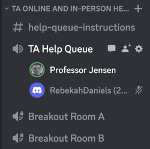

# Discord

Peer learning provides a great opportunity to build social, team building, skills. Take advantage of any chance you get to work with other learners, in and out of, class. By discussing with your peers you learn more as you ask, and answer questions. Nothing completes the learning cycle better than teaching someone else.

We use the peer chat service [Discord](https://discord.com/) to ask and answer questions, as well as get online help from the TAs and Instructor.

Use the following invite to join our discussion server:

> [https://discord.gg/PZ4fZbducn](https://discord.gg/PZ4fZbducn)

From a desktop computer, you can use Discord from your browser. From your phone you will need to install the application from the app store.

If you have never used Discord before, you will need to create a free account. Take a minute to also set up your avatar.

## A brief tour

Discord is organized by servers and channels. If you used the above invite link you should already be subscribed to our server. Discord supports text (with the ability to share images) and video chat. You can also share your screen so that you can walk through problems with others.

### Questions

Our server contains the following channels for asking and answering questions.

- **general**: Only use this if it doesn't fit anywhere else
- **announcements**: Non-questions of interest to the whole class
- **TA/common-problems**: A place for the TAs to put answers to questions you are likely to have
- **Technology channels**
  - github
  - aws
  - start up
  - html
  - css
  - javascript
  - node and express
  - caddy
  - react
  - mongo

⚠ You should use the channel that is most appropriate for your discussion. Do not ask questions in multiple channels. Only use `general` if it really is not specific to another channel.

⚠ If you are replying to someone multiple times then reply in a thread and not in the channel.

⚠ Make sure you review the instruction on [asking questions](../askingQuestions/askingQuestions.md) before you start asking questions.

### Getting help

When you want to talk with a TA either online or in-person you will use Discord to get into the queue. Under the voice channels you will see the TA chat rooms. When a TA is working (check the [schedule](https://docs.google.com/spreadsheets/d/1g1AMtgvyfSwMgp85QcwHuy0mVR-nN3bIGI6XNEJWB1U/edit?usp=sharing) for hours) and available you will see them here. Start by joining the `TA Help Queue`. When a TA becomes available they will move you into one of the breakout rooms if you are online, or move you to their discussion area if you are in-person.

## ☑ Assignment

Get on the Discord server and review each of the channels and the TA area. Review the previous instruction on asking question. Give some thought about proper forum etiquette.

Figure out who your is your assigned TA by reviewing the [TA schedule](https://docs.google.com/spreadsheets/d/1g1AMtgvyfSwMgp85QcwHuy0mVR-nN3bIGI6XNEJWB1U/edit?usp=sharing). Using their Discord ID open Discord to send them a direct message to introduce yourself.
