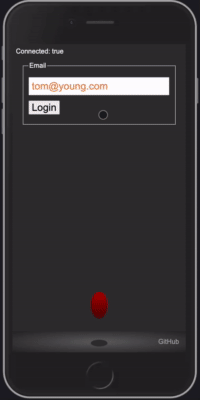

# Start up application

The primary objective of this course is to help you understand the technologies necessary to launch a web application start up. Towards this goal you will build your very own `start up` application. The actual application you build is entirely up to you, but it must successfully demonstrate the technologies we focus on.

The course is divided into distinct milestones. At each milestone you will evolve your start up application to take on more and more functionality. You start with a conceptual design document and then build a structural shell for the application using HTML. Next comes styling with CSS, interactivity with JavaScript, using third party web services, hosting your own web service, database connectivity for persistent storage, data pushed from the server with WebSockets, and finally, converting to a modern web framework with React.

- **HTML** - Basic structural and organizational elements
- **CSS** - Styling and animating
- **JavaScript** - Interactivity _(e.g. What happens when a user presses a button)_
- **Web service** - Remote functions that your application calls on your, or someone else's, web server _(e.g. saveScores, getWeather, chatWithFriend)_
- **Authentication** - Creating accounts and logging in
- **Database persistence** - Storing user data in a database _(e.g. Save the high scores and login information)_
- **WebSocket** - Support for pushing data from the server. This can be peer to peer communication _(e.g. chatting with friends through the browser)_, or realtime data from the server _(e.g. stock prices or the current game leader)_.
- **Web framework** - Using React to add components and request routing

The [Simon](https://simon.cs260.click) application is meant to give you an example of the level of complexity you are looking for, and how to build your start up application. Use Simon as a chance to experiment with things you are considering doing with your start up application. Once you learn how Simon does something you can leverage that code in your start up.

Immediately start thinking about what you would like to build. What you do for your start up application is completely up to you. So make it something that is interesting to you. It doesn't have to be complex. In fact **simple is usually better**. Dream big, but pick a very small minimal viable product for your start up application.

Keep the styling of your application simple. One common mistake is to spend enormous amounts of time trying to make your application look a certain way. Instead leverage what Simon does. Make it look reasonable and then move on to the next technology. You can always come back later and make it look better.

## Deliverables

You will turn in the following deliverable versions of your start up application.

1. Design
1. HTML
1. CSS
1. JavaScript
1. Web service with, database, authentication, and WebSocket support
1. React

You can change your project as the class progresses, but each deliverable submission must includes all the functionality defined by the previous milestones. For that reason, it is suggested that you do not change your project, and carefully consider your project from the beginning, as the longer you go, the more expensive it will be to repeat your previous work.

## Ideas

Some ideas for possible projects include:

- Simple game like connect four
- Peer chat
- Photo URL sharing
- Shared story authoring
- Book reviews
- Geo-location sharing
- News sharing
- Favorite website sharing
- Group voting
- Group calendaring
- Fitness tracking

Demonstrating the technology is more important than complexity or creativity, and basic implementations of each of the course technologies is sufficient to demonstrate your mastery.

## Examples

The [Simon](https://simon.cs260.click) demonstration application provides a good example for the level of complexity that you should be working towards. Each of the course technologies are demonstrated in about 100 lines of [code](https://github.com/webprogramming260/simon-react#readme).

This realtime [voting application](https://startup.cs260.click) provides another reasonable example.

## Demo day

At the end of class we will conduct a demo day for the best applications. Those selected for the demo day will be awarded additional credit for the exceptional work. The top presenters will be given the coveted Ghirardelli award.

