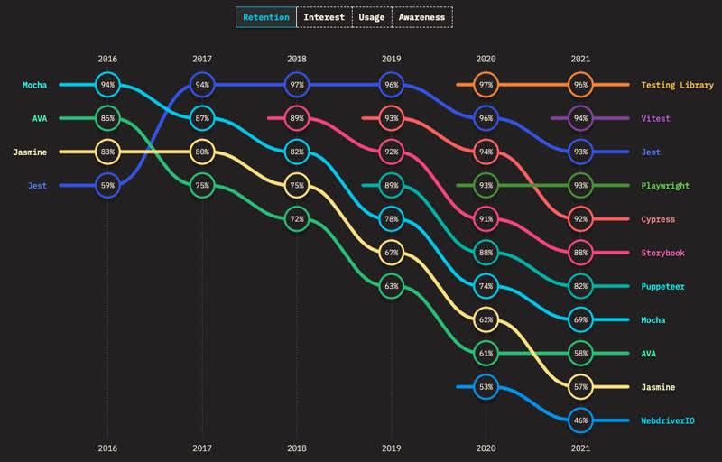
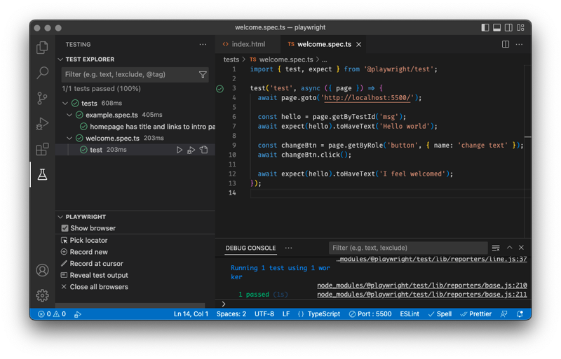

# UI testing

[Test driven development](https://www.freecodecamp.org/news/test-driven-development-what-it-is-and-what-it-is-not-41fa6bca02a2/) (TDD) is a proven methodology for accelerating the application creation, protecting against regression bugs, and demonstrating correctness. TDD for console based applications and server based code is fairly straight forward. Web application UI code is a significantly more complex to test, and to use tests to drive your UI development is even more difficult. The problem is that a browser is required to execute UI code. That means you have to actually test the application in the browser. Additionally, every one of the major browsers behaves slightly differently, view port size makes a big difference, all the code executes asynchronously, network disruptions are common, and then there is the human factor. A human will interact with the browser in very unexpected ways. Clicking where they shouldn't, clicking rapidly, refreshing the browser, flushing cache, not flushing cache, leaving the application up for days on end, switching between tabs, opening the application multiple times, logging in on different tabs, logging out of one tab while still using the application on another tab, or ... on and on. And we haven't even talked about running all the different browsers on all of the possible devices.

Of course the alternative to not use TDD or to not regression test your code is not any better. It only means that you have to manually test everything every time you make any change, or you let your users test everything. That is not a good recipe for long term success.

Fortunately this is a problem that many strong players have been working on for decades now, and the solutions, while not perfect, are getting better and better. We will look at two of these solutions. One is for executing automated tests in the browser, and the other is for testing on different browsers and devices.

## Automating the browser - Playwright

📖 **Suggested reading**: [Playwright and VS Code](https://playwright.dev/docs/getting-started-vscode)

No one understands the difficulty of testing applications in the browsers better than the companies that build web browsers. They have to test every possible use of HTML, CSS, and JavaScript that they can thing of. There was no way manual testing was going to work and so early on they started putting hooks into their applications that allowed them to be driven from automated external processes. [Selenium](https://www.selenium.dev/) was introduced in 2004 as the first popular tool to automate the browser. However, Selenium is generally considered to be flaky and slow. Flakiness means that a test fails in unpredictably, unreproducible, ways. When you need thousands of tests to pass before you can deploy a new feature, even a little flakiness becomes a big problem. If those tests take hours to run then you have an even bigger problem.

The market now has lots of alternatives when considering which automated browser framework to use. State of JS includes statistics on how these frameworks are being used. With frameworks coming and going all of the time, one telling statistic is the frameworks ability to retain users.



— Retention of browser based testing frameworks (**Source**: _2021.stateofjs.com_)

For the purposes of this instruction, we could pick any of the top contenders. However, we are going to pick a newcomer, [Playwright](https://playwright.dev/). Playwright has some major advantages. It is backed by Microsoft, it integrates really well with VS Code, and it runs as a Node.js process. It is also considered one of the least flaky of the testing frameworks.

Here is an image of Playwright running some simple tests in VS Code. You can see the listing of tests on the left, the JavaScript based tests in the editor window, and some simple console output displaying the results on the bottom. When a test fails the editor window displays a clear description of what went wrong. You can even debug the tests as they execute just like you would any other Node.js based JavaScript execution.



As a example, consider the following simplified HTML file with self contained JavaScript.

```HTML
  <body>
    <p id="welcome" data-testid="msg">Hello world</p>
    <button onclick="changeWelcome()">change welcome</button>

    <script>
      function changeWelcome() {
        const welcomeEl = document.querySelector('#welcome');
        welcomeEl.textContent = 'I feel welcomed';
      }
    </script>
  </body>
```

A Playwright test that checks to make sure the button updates the welcome test when pressed would look like the following.

```js
import { test, expect } from '@playwright/test';

test('testWelcomeButton', async ({ page }) => {
  // Navigate to the welcome page
  await page.goto('http://localhost:5500/');

  // Get the target element and make sure it is in the correct starting state
  const hello = page.getByTestId('msg');
  await expect(hello).toHaveText('Hello world');

  // Press the button
  const changeBtn = page.getByRole('button', { name: 'change welcome' });
  await changeBtn.click();

  // Expect that the change happened correctly
  await expect(hello).toHaveText('I feel welcomed');
});
```

This is just a simple test of the incredibly powerful functionality of Playwright. You are encouraged to explore its functionality and even add some tests to your projects. Once you have gained some competency with Playwright you will find that you can write your code faster and feel more confident when changing things around.

## Testing fleets of devices - Browser Stack
