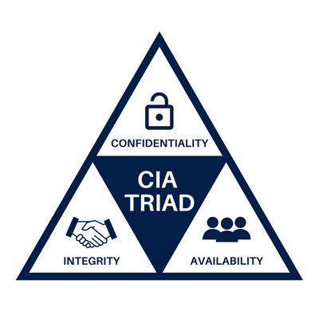

# Security Overview
## BLACK HOODIE HACKER IMAGE OR MAYBE A DANGER SYMBOL
The internet is a dangerous place. To prove it, look at the ```/var/log/auth.log``` file on your EC2 instance using ```sudo cat /var/log/auth.log```. This shows any attempts to ssh into your instance. Notice all of the random usernames and IP Addresses with recent time stamps? That's attackers trying to break into your computer as we speak!

(HERE'S AN INTERESTING STORY: I purposefully set up a user named ```admin``` with password ```password``` on my DigitalOcean instance from when I took this class in Winter 2022. Within 15 minutes, someone had gotten into it, bypassed all the restrictions I know at the time to put in, and started using it to bruteforce ssh passwords elsewhere on the internet.)

Cybersecurity, computer security, or information security is the discipline of ensuring the confidentiality, availability, and integrity of information. This information can be anything from nuclear secrets, youtube videos, emails with sensitive content, or your instagram feed.



Attackers can hack into a system using any number of methods to achieve any number of goals including:
- Bring down your IT Infrastructure (Denial of Service or DoS)
- Encrypt computers for extortion (Ransomware)
- Expose customer data (Data exfiltration)
- Mine crypto using your hardware and electricity (Cryptomalware)
- Carry out other attacks using your infrastructure (Botnet)

Application security is a subset of cybersecurity that specifically focuses on preventing security vulnerabilities within end-user applications. In the context of CS260, this means securing both the code running on your customer's browser and your server. We will demonstrate some of the exploits an attacker can pull off on an unsecured website.

## Why do I, a programmer, care?
This is a valid question, especially considering Cybersecurity is more closely related to IT than Computer Science. Why do I have to worry about security when my job is to create products, not implement systems?

The days of exposing insecure code to your customers are long gone. Instead of giving a list of possible consequences, here's a list of recent events that could've been prevented with secure programming within the last few years:
- [$100 million dollars stolen from insider trading using SQL injection vulnerability](https://www.theverge.com/2018/8/22/17716622/sec-business-wire-hack-stolen-press-release-fraud-ukraine)
- [Log4Shell remote code execution vulnerability, 93% of cloud vulnerable at time of discovery, dubbed "the most severe vulnerability ever"](https://en.wikipedia.org/wiki/Log4Shell)
- [Russian hackers install backdoor on 18,000 government and Fortune 500 computers](https://www.npr.org/2021/04/16/985439655/a-worst-nightmare-cyberattack-the-untold-story-of-the-solarwinds-hack)
- [State-sponsored hackers infect 20+ Texas towns' computers with ransomware](https://www.usnews.com/news/national-news/articles/2019-08-20/hackers-hold-computers-of-23-texas-towns-for-ransom)

A company's finances, public opinion, investor relations, and ability to make new contracts can be harmed by writing insecure code.

There are even restrictions to participating in certain industries without following defined security protocols (PROBABLY NOT NECESSARY FOR OUR PURPOSES, BUT GOOD TO BRING UP, ALSO SOMEHOW SQUEEZE NIST INTO HERE):

- Healthcare: [Health Insurance Portability Accountability Act (HIPAA)](https://www.hhs.gov/hipaa/for-professionals/security/laws-regulations/index.html)
- Contracting for US Department of Defense: [Defense Federal Acquisition Regulation Supplement (DFARS)](https://www.nist.gov/mep/cybersecurity-resources-manufacturers/compliance-cybersecurity-and-privacy-laws-and-regulations)
- Financial services: [Gramm-Leach-Bliley Act (GLBA)](https://www.ftc.gov/business-guidance/privacy-security/gramm-leach-bliley-act)

When you hear **"compliance"** used as a buzzword, they are talking about complying to a specific cybersecurity standard.

## What can I do about it?
Unfortunately, it is impossible to completely secure an application. You're smart, but attackers are smarter, but all hope is not lost. Taking effort to learn new attack vectors and their defenses can save you and your company a lot of headaches, and even set you apart from less security-conscious developers. We will go over some of the most common attacks in a web application context, but be aware that attack vectors cover every field of computer science including [AI](https://cset.georgetown.edu/publication/hacking-ai/), [CPU microarchitecture](https://mdsattacks.com/files/ridl.pdf), and [networking](https://nvd.nist.gov/vuln/detail/CVE-2022-3602).

As a web developer this most import thing you can do is:

## **DO NOT TRUST YOUR CUSTOMER**
This is a bold claim to make, especially since we struggle to get a browser to tell you the correct information in the first place, but an important concept to remember while discussing web security is that while you have complete control over your server, you don't have control over the client's browser.

SOMETHING ABOUT THE BEST WAY TO LOCKDOWN YOUR COMPANIES INFRASTRUCTURE IS NOT BY MESSING AROUND WITH THE FRONT END, BECAUSE ATTACKERS CAN CRAFT CUSTOM HTTP REQUESTS, RATHER BY MAKING SURE YOUR BACK END IS SECURE.

Being wary of any information provided by an end-user, be it seemingly legitimate form input, HTTP requests, or cookies is THE most important concept when learning application security. You have no way of knowing if a user's form input data is meant to look up information, or delete your entire database using SQL injection.

NOTES:

I want to include something about the sheer quantity of resources and man-power a state can throw at breaking into a system. It's a pretty good scare tactic.

Want to talk about CVE and NVD, and how governments are a major player in this space, contrasted with CS and it's FAANG (or whatever the modern equivalent)

Do we define Integrity vs Availability vs Confidentiality?

I gotta throw in a plug for the cybersecurity major at some point.