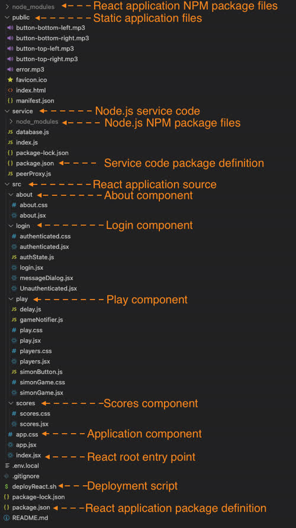
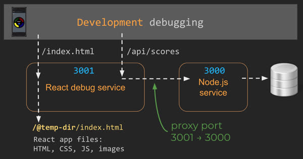

# Simon React


This deliverable demonstrates using React as a web framework. When your application starts getting more and more complex, it becomes necessary to use a web framework that helps with tasks such as building modular components, providing reactive UI elements, supporting sessions, lazy loading, and reducing (minifying) the size of your application.

Some frameworks take the additional step of abstracting parts of HTML and CSS to make authoring components easier. When this happens the project must be pre-processed in order to turn it into HTML and CSS that the browser can execute. This process requires a toolchain that executes to produce a browser ready bundle.

The introduction of React converts our application from a **multi-page application** to a **single page application**. In a single page application, the browser only loads a single HTML file (index.html), and then we use JavaScript to interactively change the rendered content and components. This is a significant architectural shift to the application and will require you to reorganize your code to fit the single page, component driven, model.

For this deliverable, we use the [React](https://reactjs.org/) framework and the associated `create-react-app` package to convert Simon into a React based application.

# Steps to convert Simon to React

The following section discusses the general steps taken to convert the Simon application from a simple HTML/CSS/JavaScript application to a React application. You will need to take similar steps for your start up project and so it is important to understand what is happening at each step conversion process. You don't necessarily have to go through this process with the Simon demonstration application, but it is a safe place to try since you have both the starting version (simon-websocket) and the ending version (simon-react) to reference.

The first step uses `create-react-app` to create a React template application that is moved into the Simon code repository. The HTML, CSS, and JavaScript is then reworked into React components. The React components are then refactored to take advantage of functionality that React provides including function style components, modularization, and a React representation of Bootstrap.

Here is a complete list of all the steps involved to convert Simon to a React application. Steps with a ⭐ prefix are detailed below in order to help clarify some of the more complicated parts.

1. ⭐ **Reorganize Simon**
1. **Commit**: Commit this version in Git as the starting place for the conversion to React. It won't run, but by committing at this point can revert if necessary, instead of starting over. Make sure you keep testing and committing throughout this process.
1. **Create template React application**. Run `npx create-react-app template-react`. This creates a new directory named `template-react` that contains the basic configuration and template React application code.
1. **Clean up template code**
   1. Uninstall and NPM packages you won't use (e.g. stats, test)
   1. Delete the unnecessary create-react-app files (e.g. images)
   1. Rename `js` JSX files have `jsx` extension
   1. Replace the `favicon.ico` with the Simon icon
   1. Update `manifest.json` to represent Simon
1. ⭐ **Move template files to Simon**
1. ⭐ **Populate App.jsx**
1. ⭐ **Create view components**
1. ⭐ **Create the router**
1. ⭐ **Convert to React components**
1. ⭐ **Convert to React Bootstrap**
1. ⭐ **Set up to debug**
1. Refactor play.jsx into simonGame.jsx, simonButton.jsx, and players.jsx
1. Refactor components to take advantage of React specific functionality and to create sub-components
1. Move webSocket code from play.jsx to gameNotifier.js

The final Simon project structure look like the following.



## Reorganize Simon

Because we are hosting both the Simon React application and the Simon service web service in the same project we need to put them each in separate directories. We want the service code in a `service` directory and the React code in the `src` directory. To accomplish this, first delete the `node_modules` directory from the `simon` directory. Then move the service code (`package.json`, `package-lock.json`, `index.js`, `database.js`, and `peerProxy.js`) into a subdirectory named `service`. Then run `npm install` in the `service` directory in order to get the NPM packages for the service.

Once you move the service to the `service` directory, you can test that the service is still working by running `node index.js` from a console window in the `service` directory. Try it out and make sure you can hit the service endpoints using Curl.

```sh
➜  curl 'localhost:3000/api/user/joe'

{"msg":"Unknown"}
```

Next, we want to put the existing UI code in a temporary place where we can then copy from as we move it to the React componentized version contained in the React `src` directory. To do this we rename the `public` directory to `old-public`. Once we have moved all the code over, we can delete the `old-public` directory.

## Move template files to Simon

Copy over the generated files from the `template-react` directory to the `simon` repository directory. You can now delete the template `template-react` directory. All steps from this point on are done in the `simon` repository directory. Run `npm install` in the root of the `simon` directory to get all of the NPM packages that React uses.

## Populate App.jsx

One of the big advantages of React is the ability to represent your web application as a modular single page application instead of a set of interconnected redundant HTML pages. Instead of an HTML page for each functional piece, you now have a React component for each functional piece. The `app.jsx` file represents the application component that is the parent of all our other components. To make `app.jsx` the Simon application component, we first move the header and footer HTML into the render function for the app. Since, this is now JSX instead of HTML we rename the `class` attribute to be `className` so that it doesn't conflict with the JavaScript `class` keyword.

```jsx
function App() {
  return (
    <div className='body bg-dark text-light'>
      <header className='container-fluid'>
        <nav className='navbar fixed-top navbar-dark'>
          <div className='navbar-brand'>
            Simon<sup>&reg;</sup>
          </div>
          <menu className='navbar-nav'>
            <li className='nav-item'>
              <a className='nav-link active' href='index.html'>
                Home
              </a>
            </li>
            <li className='nav-item'>
              <a className='nav-link' href='play.html'>
                Play
              </a>
            </li>
            <li className='nav-item'>
              <a className='nav-link' href='scores.html'>
                Scores
              </a>
            </li>
            <li className='nav-item'>
              <a className='nav-link' href='about.html'>
                About
              </a>
            </li>
          </menu>
        </nav>
      </header>

      <footer className='bg-dark text-dark text-muted'>
        <div className='container-fluid'>
          <span className='text-reset'>Author Name(s)</span>
          <a className='text-reset' href='https://github.com/webprogramming260/simon-react'>
            Source
          </a>
        </div>
      </footer>
    </div>
  );
}
```

In order for the styling to show up, move the `main.css` content into a file named `app.css` and import the CSS file into the app.jsx file.

```jsx
import `./app.css`
```

Next, we want to disable the ability to access the play and scores if the user is not authenticated. We do this with a React `useEffect` hook that will run whenever the user name changes. The hook will call out to the simon `getUser` endpoint and set a state variable based on the result. The state is then used to show or hide the play and scores NavLinks.

### Checking the authentication state

```jsx
const [userName, setUserName] = React.useState(localStorage.getItem('userName') || '');

// Asynchronously determine if the user is authenticated by calling the service
const [authState, setAuthState] = React.useState(AuthState.Unknown);
React.useEffect(() => {
  if (userName) {
    fetch(`/api/user/${userName}`)
      .then((response) => {
        if (response.status === 200) {
          return response.json();
        }
      })
      .then((user) => {
        const state = user?.authenticated ? AuthState.Authenticated : AuthState.Unauthenticated;
        setAuthState(state);
      });
  } else {
    setAuthState(AuthState.Unauthenticated);
  }
}, [userName]);
```

### Showing or hiding the navigation elements based on the authentication state

```jsx
{
  authState === AuthState.Authenticated && (
    <li className='nav-item'>
      <a className='nav-link' href='play.html'>
        Play
      </a>
    </li>
  );
}
```

## Create view components

We now create React component files `login.jsx`, `play.jsx`, `scores.jsx`, and `about.jsx` to represent each of the application views. To begin with these are just stubs that we will populate as we move functionality from the old `js` files into the `jsx` components. We place each of the stubbed components in a separate directory (e.g. `src/login/login.jsx) so that we can keep all of the component files together.

Here is the `login.jsx` stub before any code is converted over. The other components would be similar.

```jsx
import React from 'react';

export function Login() {
  return (
    <main className='container-fluid bg-secondary text-center'>
      <div>login displayed here</div>
    </main>
  );
}
```

## Create the router

With `app.jsx` containing the header and footer and all the application view component stubs created, we can now create the router that will display each component as the navigation UI requests it.

This is done by inserting the `react-router-dom` package into the project. First, install the package with `npm install react-router-dom` and then include the router component in the `index.jsx` and `app.jsx` files.

### index.jsx

The router controls the whole application by determining what component to display based upon what navigation the user chooses. In order for the router to be able to do this the `BrowserRouter` component element must have the `App` element as a child.

```jsx
const root = ReactDOM.createRoot(document.getElementById('root'));
root.render(
  <BrowserRouter>
    <App />
  </BrowserRouter>
);
```

### app.jsx

In the App component, we replace `a` elements with the router's `NavLink` component. The `href` attribute is replaced with the router's `to` attribute. The NavLink component prevents the browser's default navigation functionality and instead handles it by replacing the currently display component.

```jsx
<a className="nav-link" href="play.html">Play</a>

// to

<NavLink className='nav-link' to='/play'>Play</NavLink>
```

The nav bar now looks like the following.

```jsx
<nav className='navbar fixed-top navbar-dark'>
  <div className='navbar-brand'>
    Simon<sup>&reg;</sup>
  </div>
  <menu className='navbar-nav'>
    <li className='nav-item'>
      <NavLink className='nav-link' to=''>
        Login
      </NavLink>
    </li>
    {authState === AuthState.Authenticated && (
      <li className='nav-item'>
        <NavLink className='nav-link' to='play'>
          Play
        </NavLink>
      </li>
    )}
    {authState === AuthState.Authenticated && (
      <li className='nav-item'>
        <NavLink className='nav-link' to='scores'>
          Scores
        </NavLink>
      </li>
    )}
    <li className='nav-item'>
      <NavLink className='nav-link' to='about'>
        About
      </NavLink>
    </li>
  </menu>
</nav>
```

The router definitions are then inserted so that the router knows what component to display for a given path.

```jsx
<Routes>
  <Route path='/' element={<Login />} exact />
  <Route path='/play' element={<Play />} />
  <Route path='/scores' element={<Scores />} />
  <Route path='/about' element={<About />} />
  <Route path='*' element={<NotFound />} />
</Routes>
```

Notice that the `*` (default matcher) was added to handle the case where an unknown path is requested. A simple `NotFound` component is added to the `app.jsx` file to handle the default.

```jsx
function NotFound() {
  return <main className='container-fluid bg-secondary text-center'>404: Return to sender. Address unknown.</main>;
}
```

At this point the React application should run. You can test this.

## Converting to React components

Each of the HTML pages in the original code needs to be converted to a component represented by a corresponding `jsx` file. Each of the components is a bit different, and so you want to inspect them to see what they look like as a React component.

The basic steps for converting the component include the following.

- Copy the HTML over and put it in the return value of the component.
- The `class` attribute is renamed to `className` so that it doesn't conflict with the JavaScript keyword `class`.

- Delete the header and footer HTML since they are now represented in `app.jsx`.
- Copy the JavaScript over and turn the functions into inner functions of the React component.
- Create a file for the CSS and use an import statement in the component `jsx` file.
- Create React state variables for each of the stateful objects in the component.
- Replaced DOM query selectors with React state variables.
- Move state up to parent components as necessary. For example, authentication state, or user name state.
- Create child components as necessary. For example, a SimonGame and SimonButton component.

## Convert to React Bootstrap

There is an NPM package called [React Bootstrap](https://react-bootstrap.github.io/) that wraps the Bootstrap CSS framework in React components. This allows you to treat the Bootstrap widgets such as Button and Modal as a React component instead of just imported CSS and JavaScript.

To use the React version of Bootstrap remove the CDN links from `index.html` and import the NPM package.

```sh
npm install bootstrap react-bootstrap
```

In components where you still want to refer to the Bootstrap styles you can import the css from the
imported NPM package just like you would other CSS files.

```jsx
import 'bootstrap/dist/css/bootstrap.min.css';
```

For Simon we converted the modal dialog and button implementations to use the React Bootstrap components.

## Setup to debug

When running in production, the Simon web service running under Node.js on port 3000 serves up the Simon React application code when the browser requests `index.html`. This is the same as we did with previous Simon deliverables. The service pulls those files from the application's static HTML, CSS, and JavaScript files located in the `public` directory that we set up when we build the production distribution package.


However, when the application is running in debug mode on your development environment we actually need two HTTP servers running. One for the Node.js web service, so that we can debug the service endpoints, and one for the React client HTTP debugger, so that we can develop and debug the React application code.

To make this work when doing development debugging, we configure the React debugger HTTP server to listen on port 3001 and leave the Node.js server to listen on port 3000.



To configure the React HTTP debugger to listen on port 3001 when running in our local development environment, we create a file named `.env.local` in the root of the project, and insert the following text.

```
PORT=3001
```

Next, we modify the `package.json` file to include the field `"proxy": "http://localhost:3000"`. This tells the React HTTP debugger that if a request is made for a service endpoint, it forwards it to port 3000, where our Node.js service is listening.

```json
{
  "name": "simon-react",
  // ...
  "proxy": "http://localhost:3000"
}
```

We also need to change the front-end WebSocket initialization found in the `gameNotifier.js` constructor to explicitly use the service port (3000) instead of the React HTTP debugger port (3001). Without this the front-end will send the webSocket messages to the React debug HTTP server listening on port 3001 and unlike HTTP traffic, it will not forward them onto port 3000 automatically. To explicitly send webSocket requests to port 3000 we use the dynamically injected process environment variable that is set when webpack creates the application bundle.

```js
let port = window.location.port;
if (process.env.NODE_ENV !== 'production') {
  port = 3000;
}
```

This is a bit of annoying configuration, but without it you won't be able to debug your entire application in your development environment.

## Test as you go

That was a lot of changes and it is easy to make a mistake during the process. When you do this with your start up application you will find it easier if you start with the working app that `create-react-app` builds and then test that it runs (using `npm run start`) without error. Then make sure you understand everything it is doing before it gets more complex. After that, make a small change, and test that it still works. If it does, commit that change to Git. That way you can see where things get broken before it gets out of hand.

## Study this code

Get familiar with what the example code teaches.

- Clone the repository to your development environment.

  ```sh
  git clone https://github.com/webprogramming260/simon-react.git
  ```

- Review the code and get comfortable with everything it represents.
- View the code in your browser by hosting it from a VS Code debug session.
- Make modifications to the code as desired. Experiment and see what happens.

## Deploy to production

- Deploy to your production environment using a copy of the `deployReact.sh` script found in the [example class application](https://github.com/webprogramming260/simon-react/blob/main/deployReact.sh). Take some time to understand how it works.

  ```sh
  ./deployReact.sh -k <yourpemkey> -h <yourdomain> -s simon
  ```

  For example,

  ```sh
  ./deployReact.sh -k ~/keys/production.pem -h yourdomain.click -s simon
  ```

  ⚠ **NOTE** - The deployment script for this project is different than pervious deployment scripts since it includes the bundling of your React application.

- Update your `start up` repository README.md to record and reflect on what you learned.
- Make sure your project is visible from your production environment (e.g. https://simon.yourdomain.click).
- Submit the URL to your production environment for grading using the Canvas assignment page.

## Grading Rubric

- 50% - Simon React deployed to your production environment
- 50% - Notes in your start up repository README.md about what you have learned

## Celebrate

Wow! That is the last Simon deliverable. We hope that you were able to discover and master a lot of new technology by developing this game. You definitely deserve to reward yourself for all the work you have done here. I'm thinking maybe donuts. 🍩
