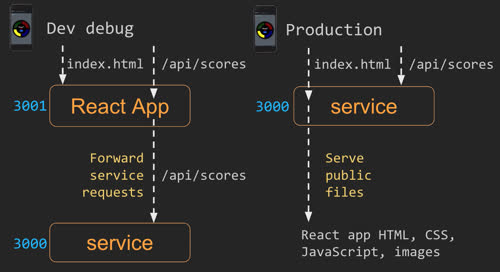

# Simon React


This deliverable demonstrates using React as a web framework. When your application starts getting more and more complex it becomes necessary to use a web framework that helps with tasks such as building modular components, providing reactive UI elements, supporting sessions, lazy loading, and reducing (minifying) the size of your application.

Some frameworks take the additional step of abstracting parts of HTML and CSS to make authoring components easier. When this happens the project must be pre-processed in order to turn it into HTML and CSS that the browser can execute. This process requires a toolchain that executes to produce a browser ready bundle.

The introduction of React converts our application from a multi-page application to a single page application. This means the browser only loads a single HTML file (index.html) and then we use JavaScript to interactively change the rendered content and components.

For this deliverable we use the [React](https://reactjs.org/) framework and the associated `create-react-app` package to convert Simon into a React based application.

# Steps to convert Simon to React

The following section discusses the general steps taken to convert the Simon application from a simple HTML/CSS/JavaScript application to a React application. You will need to take similar steps for your start up project and so it is important to understand what is happening at each step conversion process.

The first step was to use `create-react-app` to create a template that we can then populate with the code from the previous Simon version. The JavaScript code was then moved into React components. The React components were then refactored to take advantage of functionality that React provides including function style components, modularization, and a React representation of Bootstrap.

Here is the list of all the steps involved in the conversion. Some of these steps are detailed below in order to help clarify some of the more complicated parts.

1. **Create template React application**. Run `npx create-react-app simon-react`. This creates a new directory for the project where the initial conversion takes place. Clean up template code.
   1. Uninstall and NPM packages you won't use (e.g. stats, test)
   1. Delete the unnecessary create-react-app files (e.g. images)
   1. Rename `js` JSX files have `jsx` extension
   1. Replace the `favicon.ico` with the Simon version
   1. Update `manifest.json` to represent Simon
1. ⭐ **Move service Code**. In the original `simon` repository move the service code and `node_modules` folder into a folder named `service`
1. **Add React code to Simon**. Copy over the generated code from the `simon-react` folder to the `simon` folder
1. **Commit**: Commit this version in Git as the starting place for the conversion to React. It won't run, but by committing at this point can revert if necessary, instead of starting over. Make sure you keep committing throughout this process.
1. ⭐ **Populate App.jsx**
1. ⭐ **Create view components**
1. ⭐ **Create the router**
1. ⭐ **Convert to React components**
1. ⭐ **Convert to React Bootstrap**
1. ⭐ **Set up to debug**
1. Refactor other components to take advantage of React specific functionality and to create sub-components
1. Refactor play.jsx into simonGame.jsx, simonButton.jsx, and players.jsx
1. Move webSocket code from play.jsx to gameNotifier.js

The final Simon project structure should look something like the following.


## Move service code

Because we are hosting both the Simon React application and the Simon service web service in the same project we need to create a clear separation of each of those code pieces. To do this we put all of the service code in a folder named service. The React project code stays where `create-react-app` put it, in the `public`, and `source` directories. Since they are two different NPM projects you need to make sure you run `NPM install` in both the `./` and `./service` directories.

Once you move the service to the `service` directory, you can test that it is working running `node index.js` for a console window, or from VS Code using the Node debugger launch configuration. Try it out and make sure you can hit the endpoints using Curl.

```sh
➜  curl 'localhost:3000/api/user/joe'

{"msg":"Unknown"}
```

## Populate App.jsx

One of the big advantages of React is the ability to represent your web application as a modular single page application instead of a set of interconnected redundant HTML pages. Instead an HTML page for each functional piece, you now have a React component for each functional piece. The `app.jsx` file represents the application component that is the parent of all our other components. To make `app.jsx` the Simon application component, we first move the header and footer into the render function for the app. Since this is now JSX instead of HTML we rename the `class` attribute to be `className` so that it doesn't conflict with the JavaScript `class` keyword.

```jsx
function App() {
  return (
    <div className='body bg-dark text-light'>
      <header className='container-fluid'>
        <nav className='navbar fixed-top navbar-dark'>
          <div className='navbar-brand'>
            Simon<sup>&reg;</sup>
          </div>
          <menu className='navbar-nav'>
            <li className='nav-item'>
              <a className='nav-link active' href='index.html'>
                Home
              </a>
            </li>
            <li className='nav-item'>
              <a className='nav-link' href='play.html'>
                Play
              </a>
            </li>
            <li className='nav-item'>
              <a className='nav-link' href='scores.html'>
                Scores
              </a>
            </li>
            <li className='nav-item'>
              <a className='nav-link' href='about.html'>
                About
              </a>
            </li>
          </menu>
        </nav>
      </header>

      <footer className='bg-dark text-dark text-muted'>
        <div className='container-fluid'>
          <span className='text-reset'>Author Name(s)</span>
          <a className='text-reset' href='https://github.com/webprogramming260/simon-react'>
            Source
          </a>
        </div>
      </footer>
    </div>
  );
}
```

In order for the styling to show up, move the `main.css` content into a file named `app.css` and import the CSS file into the app.jsx file.

```jsx
import `./app.css`
```

🚧 add and explain this

- Disable nav links if not authenticated.
- Consider moving navs to react-bootstrap

## Create view components

Create React component files `login.jsx`, `play.jsx`, `scores.jsx`, and `about.jsx` to represent each of the application views.

## Create the router

With `app.jsx` containing the header and footer and all the application view component created, we can now create the router that will display each component as the navigation UI requests it.

This is done by inserting the `react-router-dom` package into the project. First, install the package with `npm install react-router-dom` and then include the router component in the `index.jsx` and `app.jsx` files.

**index.jsx**
The router controls the whole application and so we put the `BrowserRouter` component element around our `App` element.

```
const root = ReactDOM.createRoot(document.getElementById('root'));
root.render(
  <BrowserRouter>
    <App />
  </BrowserRouter>
);
```

**app.jsx**
In the App component we replace `a` elements with the router's `NavLink` component. The `href` attribute is replaced with the router's `to` attribute. The NavLink component prevents the browser's default navigation functionality and instead handles it by replacing the currently display component.

```jsx
<a className="nav-link" href="play.html">Play</a>

// to

<NavLink className='nav-link' to='/play'>Play</NavLink>
```

The router definitions are then inserted so that the router knows what component to display for a given path.

```jsx
<Routes>
  <Route path='/' element={<Login />} exact />
  <Route path='/play' element={<Play />} />
  <Route path='/scores' element={<Scores />} />
  <Route path='/about' element={<About />} />
  <Route path='*' element={<NotFound />} />
</Routes>
```

Notice that the `*` (default matcher) was added to handle the case where an unknown path is requested. A simple `NotFound` component is added to the `app.jsx` file to handle the default.

```jsx
function NotFound() {
  return <main className='container-fluid bg-secondary text-center'>404: Return to sender. Address unknown.</main>;
}
```

## Converting to React components

🚧 This needs to be fixed

Each of the HTML pages in the original code needs to be converted to a component represented by a corresponding `jsx` file. Here are the steps necessary to convert the Login functionality from an HTML/CSS/JS file based representation into a React component JSX representation.

- Since we are building a single page application, we already moved the header (along with navigation) and footer into the app component. We can then drop that code out of all the component.
- Create a Login component using a React function style component.
- The component function displays the child components based upon if the user is already authenticated or not.
- All of the functions for logging in are added as member functions of the component class. The this pointer is used to call other functions in the class.
- The React `useNavigate` function is used to interact with the React router. We use this to navigate to the play component when the play button is pressed.
- The `class` attribute is renamed to `className` so that it doesn't conflict with the JavaScript keyword `class`.
- The value for the onClick event handlers is changed to a function call on the component using the arrow syntax so that we have access to the this pointer of the Login object (`{() => this.loginUser()}`).
- The Login component's CSS is copied over and added as in import in the login component (`import './login.css'`).
- Replaced DOM query selectors with reactive variables
- Added AuthState enum

You can now do similar steps to convert the other application components.

🚧 The other components need cleaning up

## Convert to React Bootstrap

🚧 cleanup

https://react-bootstrap.github.io/

Get rid of CND links

npm import bootstrap react-bootstrap

Add

import 'bootstrap/dist/css/bootstrap.min.css';

to app.jsx

Replace the direct Bootstrap JavaScript calls to display the dialog with the react-bootstrap modal component.

import Modal from 'react-bootstrap/Modal';

Changed button to be Button

## Setup to debug

When running in production, the Simon web service running under Node.js on port 3000 serves up the Simon React application code when the browser requests `index.html`. This is the same as we did with previous Simon deliverables. Requests for the client code are handled by the Node.js server returning the React application's static HTML/CSS/JavaScript files from the public directory.

However, when the application is running in debug mode on your development environment we actually need two HTTP servers running. One for the Node.js web service so that we can debug the service endpoints, and one for the React client HTTP debugger so that we can develop and debug the React application code.

To make this work when doing development debugging, we configure the React debugger HTTP server to listen on port 3001 and leave the Node.js server to listen on port 3000.



We configure the React HTTP debugger to listen on port 3001 when running in our local development environment by creating a file named `.env.local` in the root of the project, and inserting the following text.

```
PORT=3001
```

Next, modify the `package.json` file to include the field `"proxy": "http://localhost:3000"`. This tells the React HTTP debugger that if a request is made for a service endpoint, it forwards it to port 3000, where our Node.js service is listening.

```json
{
  "name": "simon-react",
  // ...
  "proxy": "http://localhost:3000"
}
```

🚧 Change WebSocket initialization to use port 3000 when debugging in development

This is a bit of annoying configuration, but without it you won't be able to debug your entire application in your development environment.

## Test as you go

That was a lot of changes and it is easy to make a mistake during the process. It is easier if you start with the working app that `create-react-app` builds and then make sure it runs (using `npm run start`) without error. Make sure you understand everything it is doing before it gets more complex. Then make a small change, and test that it works. That way you can see where things get broken before it gets out of hand.

## Study this code

Get familiar with what the example code teaches.

- Clone the repository to your development environment.
  ```sh
  git clone https://github.com/webprogramming260/simon-react.git
  ```
- Review the code and get comfortable with everything it represents.
- View the code in your browser by hosting it from a VS Code debug session.
- Make modifications to the code as desired. Experiment and see what happens.

## Make your own version

- Convert your `simon` application to use React, or create an entirely new version of Simon using React, with the [example implementation](https://github.com/webprogramming260/simon-react) as your guide. Here is the working demonstration [Simon React](https://simon-react.cs260.click) application. Remember that you do not need to create an original work. Just focus on learning the concepts that the example project provides. However, you will learn more if you type everything out, and not just copy and paste the code.
- Set the footer link to point to your code repository. (e.g. https://github.com/yourname/simon)
- Periodically commit and push your code to your repository as you hit different milestones. (4 commits are required for full credit.)
- Deploy to your production environment using a copy of the `deployReact.sh` script found in the [example class application](https://github.com/webprogramming260/simon-react/blob/main/deployReact.sh). Take some time to understand how it works.

  ```sh
  ./deployReact.sh -k <yourpemkey> -h <yourdomain> -s simon
  ```

  For example,

  ```sh
  ./deployReact.sh -k ~/keys/production.pem -h yourdomain.click -s simon
  ```

  ⚠ **NOTE** - The deployment script for this project is different than pervious deployment scripts since it includes the bundling of your React application.

- Update your `start up` repository README.md to record and reflect on what you learned.
- When you have completed your version. Do a final push of your code and deploy to your production environment using the `deployReact.sh` script.
- Make sure your project is visible from your production environment (e.g. https://simon.yourdomain.click).
- Submit the URL to your production environment for grading using the Canvas assignment page.

## Grading Rubric

- 10% - Used `create-react-app` to build a template React application
- 20% - Successfully converted the header and footer to the App component
- 30% - Successfully converted to React components
- 20% - Successfully implemented the React router
- 10% - At least four Git commits for the project (Initial, milestone, ..., milestone, final)
- 10% - Notes in your start up repository README.md about what you have learned
