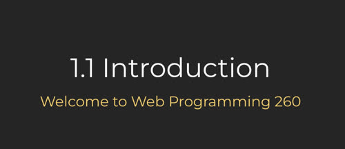

# In person instruction slides

The following slide decks are used for in person discussion of the instruction topics. They act as a supplement to the [instruction topics](../instructionTopics.md) and often only make sense when cross referenced to the instruction. However, they do serve useful when trying to understand the flow of the content.

⚠ Note that these slides are always a work in progress. If you want to capture what they are currently showing, make sure you create a copy.

## Essentials

- [1.1 Introduction](https://docs.google.com/presentation/d/1tYFgMQMo8JrevxDkEpkE8s-E8jxgi1P_JX1LUacQlfo/edit?usp=sharing)
- [1.2 History & Questions](https://docs.google.com/presentation/d/1IuVslAXRzrrzSpQzNnRkLqo87B8wXI2mMUiPYxbynuY/edit?usp=sharing)
- [1.3 Essentials](https://docs.google.com/presentation/d/1n2AjZpKHTJxoBfkuvGgCzyElQd_FjUSURQ1JwLlfcNw/edit?usp=sharing)
- [1.4 Console & Editors](https://docs.google.com/presentation/d/1E1VnWadmtFGIP6EAnas91W8Cx2lP5xgDvXJTrOUQrEs/edit?usp=share_link)
- [1.5 Git](https://docs.google.com/presentation/d/1KeuW4C16M8rM8yey6zWq7pmjxIYXmR7jWo5itsU7jZc/edit?usp=sharing)
- [1.6 GitHub](https://docs.google.com/presentation/d/1_4HH4ABpVYBtjD0GgHWC-_XhSdltnKsU4jgUhQqk61U/edit?usp=share_link)
- [1.7 Final essentials](https://docs.google.com/presentation/d/1q27z_hD7aqVSrH3Z-fDGOsAUa8gSM3inFQhtSv0VnLo/edit?usp=share_link)

## Web servers

- [2.1 Servers & EC2](https://docs.google.com/presentation/d/19Ppq6FiBxgAvo1NlWrNeW2onmydEiCKSCWE9VPS_6r4/edit?usp=share_link)
- [2.2 DNS & Route53](https://docs.google.com/presentation/d/1QvdOIvCukGEffAJI9B6XL-uFALc5dwcLjjA4LMTy81s/edit?usp=share_link)
- [2.3 Caddy, HTTPS, TLS, certs](https://docs.google.com/presentation/d/1I7E_nlpxa-z9bOPS3yd80N_S2qLdSg5UmkHcwbZDq0g/edit?usp=share_link)

## HTML & CSS

- [3.1 HTML](https://docs.google.com/presentation/d/1e4ZCORiT43CAE33uqRDx89JlaV1OeyqJYyr0yK_3fPg/edit?usp=share_link)
- [3.2 HTML website, Simon HTML](https://docs.google.com/presentation/d/1gVOTS5HkeiFRDn_FK8-K0TVmzW6Q_zO6YbuG9qVz43A/edit?usp=share_link)
- [3.3 CSS rulesets](https://docs.google.com/presentation/d/1JfFeinOhpasd3t5qbEUfrG6OhNx_QwGC98UTvtjk3XQ/edit?usp=share_link)
- [3.4 Fonts, animation, practice](https://docs.google.com/presentation/d/1mGxLtoNZy8sxbHje3hPixaTfGkohz5EvZanjEC_reoI/edit?usp=share_link)
- [3.5 Responsive, grid, flex](https://docs.google.com/presentation/d/1GkWkkHjtb_HMrrE6lbf9E0ByB5y7WdMuwvV5-JDu-D8/edit?usp=share_link)
- [3.6 CSS debugging, frameworks, Simon CSS](https://docs.google.com/presentation/d/1Ilu3fL0XWaf3ufnXgWqD0C7sBYcOO843NHWke2dw03Y/edit?usp=share_link)
- [3.7 UX design](https://docs.google.com/presentation/d/1MPtHwjvcOdW-PbGjYcRVH-peYQzJmcihrtxmyeMywcs/edit?usp=share_link)

## JavaScript

- [4.1 Types, operators, conditionals, loops](https://docs.google.com/presentation/d/1w4-k2CjqUyOMRNpSuumbSakOlyoiI-ddhpU4cZLYUV0/edit?usp=sharing)
- [4.2 Functions, objects, classes](https://docs.google.com/presentation/d/1Whmovzfhce1djN-YT8PqI1k7JvvfnSveMcz7LNTodVQ/edit?usp=sharing)
- [4.3 Regex, rest/spread, destructure, exception](https://docs.google.com/presentation/d/1c2_7wC3Bfyec9-3L8SKXxJ415c5W0siUfeKeuVaRErw/edit?usp=sharing)
- [4.4 Scope, modules, DOM](https://docs.google.com/presentation/d/1SWq0kLCWW3mBKnCeL5cdhNyUobOoji9apZ9QXPCMtn4/edit?usp=sharing)
- [4.5 Promises, async/await](https://docs.google.com/presentation/d/1_RKk91Px_UJdgroZPNqFkJI_MA_Xsul1ocp66qljET4/edit?usp=sharing)
- [4.6 Debugging, Simon JS, Start up JS](https://docs.google.com/presentation/d/1ptSWxXFXzhJ-KUqvmzjir1ZtWXTMBH-pS2H9aXGwdLs/edit?usp=sharing)
