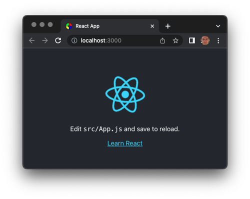
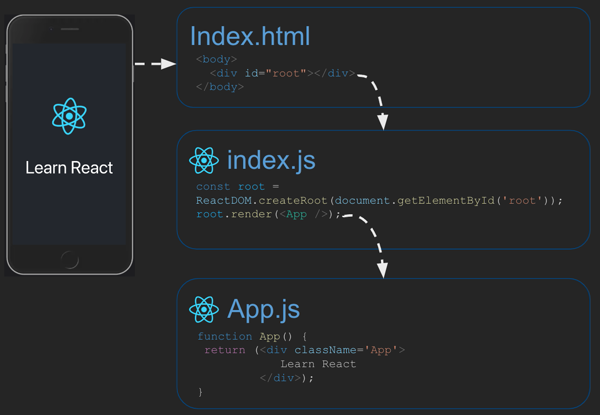
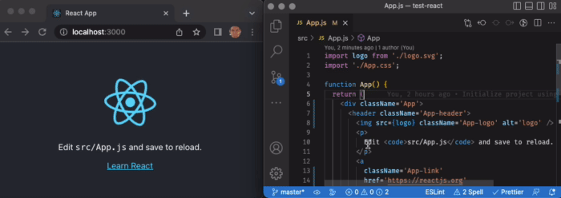

# React CLI

🔑 **Required reading**: [Create React App Getting Started](https://create-react-app.dev/docs/getting-started)

Now that we have covered the basics of React, we want to extend our usage to include a full web framework toolchain that allows us to use JSX, minification, polyfills, and bundling for our Simon and start up applications. One common way for configuring your project to take advantage of these technologies is to use a Command Line Interface (CLI) to initially set up a React based project.

A CLI is a program that runs from the console and usually provides an assortment of commands related to some specific purpose. For example, the [AWS CLI](https://aws.amazon.com/cli/) allows you to interact with all of its services. This saves you the time of having to bring up the AWS website interface when you want to use an AWS service. Instead of opening a browser, logging in, navigating to a service, and walking through a bunch of UI dialogs, you simply open your console window and use the AWS CLI to execute a single command.

To set up our React toolchain we will use the `create-react-app` CLI. This CLI will create and configure a template React application that you can use as a starting place for your application. `create-react-app` is an NPM package that works as a console program. Previously you used npm packages to add code libraries to your applications, but you can also run NPM packages as if they were a console program, if they are [configured](https://blog.npmjs.org/post/118810260230/building-a-simple-command-line-tool-with-npm.html) to do so.

The common way to run CLI NPM programs is to use the `NPX` program that was included when you installed NPM. NPX will temporarily download the desired package from NPM and then execute it using Node. Basically, NPX is just a short cut for `NPM install` and `NPM start`. It also has the advantage of not actually persistently installing the package and so it doesn't leave any clutter behind in your development environment.

When you run `create-react-app` with NPX, it creates a brand new React application project based on a standard template. You can see how this works by running the following from your console window. Make sure you are in a directory where you keep your coding projects. For example, `cd ~/src/byu/cs260`.

```sh
npx create-react-app test-react
```

When this runs it will create a project directory named `test-react`, create a bunch of project template files, and install the NPM packages necessary to use React and the associated toolchain. You can examine the project it created by changing into the `test-react` directory and opening VS Code.

```sh
cd test-react
code .
```

Before we look at what the generated project contains, let's run the application and see what it does. From the `test-react` directory run `npm start`.

```sh
➜  npm start

Compiled successfully!

You can now view test-react in the browser.

  Local:            http://localhost:3000
```

This should automatically launch the application and open your browser to display the application running on port 3000.



To stop the application, use the `CTRL-C` (kill) keystroke in the console window where you started it.

Congratulations you have just used a CLI to create a React based web application. Time for cookies.

## Generated project

Let's examine the file and directory structure that `create-react-app` created.

| Directory | File               | Purpose                                                      |
| --------- | ------------------ | ------------------------------------------------------------ |
| ./        | .gitignore         | Specifies files to not include in your Git commits           |
|           | package-json       | NPM definition for included packages and script commands     |
|           | package-lock.json  | Version constraints for included packages (do not edit this) |
|           | README.md          | GitHub readme for the project                                |
| ./public  | index.html         | Primary page for the application                             |
|           | favicon.ico        | Primary application icon                                     |
|           | logo\*.png         | Icons used for mobile devices                                |
|           | manifest.json      | Configuration for use on mobile devices (PWA support)        |
|           | robots.txt         | Directives for search engine crawlers like Google            |
| ./src     | index.js           | Entry point for code execution                               |
|           | index.css          | CSS for top level component                                  |
|           | App.css            | CSS for the main application component                       |
|           | App.js             | JavaScript for the main application component                |
|           | App.test.js        | Automated tests for the main application component           |
|           | logo.svg           | Image displayed in the main application component            |
|           | reportWebVitals.js | Configuration for reporting application performance          |
|           | setupTests.js      | Set up for automated tests                                   |

At a high level `create-react-app` did the following:

1. Updated `./package-json` to include the necessary NPM packages for running and testing a React application.
1. Created `./public/index.html` as the entry point for the browser to load your application
1. Created `./src/index.js` to initialize the React application
1. Created `./src/app.js` to provide the top level React component

All the other files provide styling, use on mobile devices, testing, and performance monitoring.

## Digging into the generated code

When the browser requests to load your application it gets `index.html` by default. `index.html` contains the basic metadata for the application, but the actual content is injected into the HTML, at runtime, based upon the code contained in `index.js`. This happens because React by default will look for a file named `index.js` and execute it. The `index.js` file contains code that looks for a `div` element named `root` and renders the App component into that div. This causes the `App` component to be loaded from `App.js` which finally provides the content that you see visualized in the browser.



From this basic template code, you can build your application by replacing the App component, adding new React child components to the App component, and introducing a React router.

## What the toolchain is doing

When you run `npm start` it executes the `start` script found in `package.json`.

```json
  "scripts": {
    "start": "react-scripts start",
    "build": "react-scripts build",
  }
```

This runs another NPM CLI package called `react-scripts` and tells it to build the application from the code and launch it with a development HTTP server similar to the Live Server extension you have been using in VS Code. `react-scripts` then launches your browser and points it to `localhost:3000` where you can see the application rendering. Note that the development HTTP server will monitor changes to the application source and automatically rebuild it. Try this out by starting the application, editing the `App.js` file to contain something different, saving it, and looking at the browser window displaying the application.



When `react-scripts` builds the application it converts the React JSX files to valid JavaScript and populates the `index.html` file with references to the generated files. If you look at `index.html` in your project, you will see that it contains a fairly bare bones HTML page.

**Template version of index.html**

```html
<html lang="en">
  <head>
    <meta charset="utf-8" />
    <link rel="icon" href="%PUBLIC_URL%/favicon.ico" />
    <meta name="viewport" content="width=device-width, initial-scale=1" />
    <meta name="theme-color" content="#000000" />
    <meta name="description" content="Web site created using create-react-app" />
    <link rel="apple-touch-icon" href="%PUBLIC_URL%/logo192.png" />
    <link rel="manifest" href="%PUBLIC_URL%/manifest.json" />
    <title>React App</title>
  </head>
  <body>
    <div id="root"></div>
  </body>
</html>
```

If you start the application, and use the browser's debugger to look at the actual HTML loaded into the DOM you will see the result of the toolchain manipulation and bundling. (Note that this code has been abbreviated for clarity of the example.) Our `index.html` file now has injected file paths, JavaScript for running the React web framework in the browser, CSS elements for the currently rendered components, and the transpiled component HTML from the React components.

**DOM version of index.html**

```html
<html lang="en">
  <head>
    <meta charset="utf-8" />
    <!-- path for public files in injected -->
    <link rel="icon" href="/favicon.ico" />
    <meta name="viewport" content="width=device-width, initial-scale=1" />
    <meta name="theme-color" content="#000000" />
    <meta name="description" content="Web site created using create-react-app" />
    <link rel="apple-touch-icon" href="/logo192.png" />
    <link rel="manifest" href="/manifest.json" />
    <title>React App</title>
    <!-- The minified JavaScript for using React as the web framework -->
    <script defer="" src="/static/js/bundle.js"></script>
    <!-- CSS styles are inserted from the component CSS. -->
    <style>
      body {
        margin: 0;
        font-family: 'Roboto', 'Oxygen', 'Ubuntu', sans-serif;
      }
      .App {
        text-align: center;
      }
    </style>
  </head>
  <body>
    <!-- Root application JSX transpiled and inserted -->
    <div id="root">
      <!-- Application component JSX transpiled and inserted -->
      <div class="App">
        <header class="App-header">
          
          <p>Edit <code>src/App.js</code> and save to reload.</p>
          <a class="App-link" href="https://reactjs.org" target="_blank" rel="noopener noreferrer">Learn React</a>
        </header>
      </div>
    </div>
  </body>
</html>
```

## Modifying the generated project

There is nothing that `create-react-app` does that you should consider off limits for change or improvement. If you take the time to understand what it is doing and why, then you should feel free to customize the application to how you would like it to work. At a basic level you should always do the following:

1. Replace the icon files with your own icons
1. Modify the manifest.json and package.json to contain your application name
1. Modify the README.md to describe your application
1. Modify index.html to contain a proper title and description metadata.

### Removing testing and performance monitoring

As an example of more extension modifications, we can remove the testing and performance packages that `create-react-app` included in the template. You might do this because you are trying to simplify the project for demonstration purposes, or because you want to replace it with a different testing framework such as Playwright.

To make this change, we first use NPM to **uninstall** the `@testing-library` packages. This removes the packages from `package.json` so that they are no longer installed in `node_modules` when you run `npm install`.

```sh
npm uninstall @testing-library/jest-dom @testing-library/react @testing-library/user-event
```

Next delete the test JavaScript files `setupTest.js` and `App.test.js`. With the testing packages gone, nothing will call this code and so we can simply delete it.

```sh
rm src/setupTests.js src/App.test.js
```

We can also remove the performance reporting package and code in order to simplify our application even further.

```sh
npm uninstall web-vitals
rm src/reportWebVitals.js
```

Finally, we remove the references to `reportWebVitals` from `index.js` since that package is no longer available.

**index.js**

```js
import React from 'react';
import ReactDOM from 'react-dom/client';
import './index.css';
import App from './App';
// -> Delete
// import reportWebVitals from './reportWebVitals';

const root = ReactDOM.createRoot(document.getElementById('root'));
root.render(
  <React.StrictMode>
    <App />
  </React.StrictMode>
);

// -> Delete
// reportWebVitals();
```

If we run `npm start` again the application will run the same as before, but without testing or performance monitoring support. You can now insert a different package for these vital functions if you so desire.

If you want to strip the project down even more, you can also delete the robots.txt, manifest.json, and the logo\*.png files.

Temporarily deleting code is sometimes a good strategy to use when trying to learn how the code works. If everything is committed to Git then you can easily do experiments like this.

### JSX vs JS

The `create-react-app` CLI uses the `.js` (JavaScript) extension for JSX files instead of `.jsx`. The Babel transpiler will work with either one, but some editor tools will work differently based upon the extension. For this reason, you might consider renaming the `.js` files that actually contain JSX to use `.jsx` instead. The developers at AirBNB had an interesting [conversation](https://github.com/airbnb/javascript/pull/985) on this topic that you might browse if you would like to consider the differing opinions on this subject.

## Building a production release

Now that you have your React application the way that you like you need to build a production ready release. You do this by running `npm run build`. The executes the `build` script found in your `package.json`. The `build` script transpiles, minifies, and injects the proper JavaScript, and then outputs everything to a deployment ready version contained in a subdirectory named `build`.

```sh
➜  npm run build

Creating an optimized production build...
Compiled successfully.
```

The deployment scripts for Simon React creates a distribution package by calling `npm run build` and then copying the `build` directory out to your production server.

## Other React project generators

The `create-react-app` CLI is not the only tool that you can use to generate a templated React project. For example, there is also `nano-react-app`, that uses [Vite](https://vitejs.dev/) instead of [webpack](https://webpack.js.org/), and results in a very minimal collection of template files. If you are comfortable with what `create-react-app` is doing, then you might experiment with some of the other CLI alternatives. Otherwise, just stick with `create-react-app` for now.

## ☑ Assignment

Experiment with `create-react-app` by creating a test application named `test-react-cli`. Run the application using `npm start`. Then alter the code by changing the content, deleting functionality, and adding a simple component. Finally, build a production deployment version of the application with `npm run build`. When you are done submit a comment about something you found interesting, to the Canvas assignment.

Don't forget to update your GitHub start up repository README.md with all of the things you learned and want to remember.
