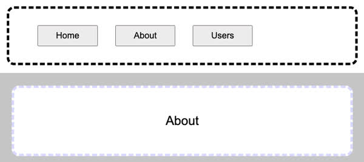

# Router

**Required reading**: [React Router DOM Tutorial](https://blog.webdevsimplified.com/2022-07/react-router/)

A web framework router provides essential functionality for single page applications. With a multiple web page application the headers, footers, navigation, and common components must be either duplicated in each HTML page, or injected before the server sends the page to the browser. With a single page application the browser only loads one HTML page and then JavaScript is used to manipulate the DOM and give it the appearance of multiple pages. The router defines the routes a user can take through the application, and automatically manipulates the DOM to display the appropriate framework components.

React does not have a standard router package, and there are many that you can choose from. We will use [react-router-dom](https://www.npmjs.com/package/react-router-dom) Version 6. The simplified routing funcitonality of React-router-dom derives from the project [react-router](https://www.npmjs.com/package/react-router) for its core runctionality. Do not confuse the two, or versions of react-router-dom before version 6, when reading tutorials and documentation.



A basic implementation of the router consists of a `BrowserRouter` component that encapsulates the entire application and controls the routing action. The `Link` component captures user navigation events and modifies what is rendered by the `Routes` component by matching up the `to` and `path` attributes.

```jsx
// Inject the router into the application root DOM element
const root = ReactDOM.createRoot(document.getElementById('root'));
root.render(
  // BrowserRouter component that controls what is rendered
  // Link component captures user navigation requests
  // Routes component defines what component is routed to
  <BrowserRouter>
    <div className='app'>
      <nav>
        <ul>
          <button>
            <Link to='/'>Home</Link>
          </button>
          <button>
            <Link to='/about'>About</Link>
          </button>
          <button>
            <Link to='/users'>Users</Link>
          </button>
        </ul>
      </nav>

      <main>
        <Routes>
          <Route path='/' element={<Home />} exact />
          <Route path='/about' element={<About />} />
          <Route path='/users' element={<Users />} />
        </Routes>
      </main>
    </div>
  </BrowserRouter>
);
```

## ☑ Assignment

Create a fork of this [codePen](https://codepen.io/leesjensen/pen/poKLKaX) and experiment.

When you are done submit your CodePen URL, along with a description of something you found interesting, to the Canvas assignment.
