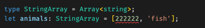

# TypeScript

📖 **Deeper dive reading**: [Typescript in 5 minutes](https://www.typescriptlang.org/docs/handbook/typescript-in-5-minutes.html)

TypeScript adds static type checking to JavaScript. This provides type checking while you are writing the code to prevent mistakes like using a string when a number is expected. Consider the following simplistic JavaScript code example.

```js
function increment(value) {
  return value + 1;
}

let count = 'one';
console.log(increment(count));
```

When this code executes the console will log `one1` because the count variable was accidentally initialized with a string instead of a number.

With TypeScript you explicitly define the types, and as the JavaScript is transpiled (with something like Babel) an error will be generate long before the code in see by a user. To provide type safety for our increment function, it would look like this:

```ts
function increment(value: number) {
  return value + 1;
}

let count: number = 'one';
console.log(increment(count));
```

With TypeScript enabled, VS Code will analyze the code and give you an error about the invalid type conversion.


In addition to defining types for function parameters, you can define the types of object properties. For example, when defining the state for a React class style component, you can specify the types of all the state values.

```ts
export class About extends React.Component {
  state: {
    imageUrl: string;
    quote: string;
    quoteAuthor: string;
  };

  constructor(props: object) {
    super(props);

    this.state = {
      imageUrl: '',
      quote: 'loading...',
      quoteAuthor: 'unknown',
    };
  }
}
```

You can likewise specify the type of a React function style component's properties with an inline object definition.

```ts
function Clicker(props: { initialCount: number }) {
  const [count, updateCount] = React.useState(props.initialCount);

  return <div onClick={() => updateCount(1 + count)}>Click count: {count}</div>;
}
```

## Interfaces

Because it is so common to define object property types, TypeScript introduced the use of the `interface` keyword to define a collection of parameters and types that an object must contain in order to satisfy the interface type. For example, a Book interface might look like the following.

```ts
interface Book {
  title: string;
  id: number;
}
```

You can then create an object and pass it to a function that requires the interface.

```ts
function catalog(book: Book) {
  console.log(`Cataloging ${book.title} with ID ${book.id}`);
}

const myBook = { title: 'Essentials', id: 2938 };
catalog(myBook);
```

## Beyond type checking

TypeScript also provides other benefits, such as warning you of potential uses of an uninitialized variable. Here is an example of when a function may return null, but the code fails to check for this case.


You can correct this problem with a simple `if` block.

```ts
const containerEl = document.querySelector<HTMLElement>('#picture');
if (containerEl) {
  const width = containerEl.offsetWidth;
}
```

Notice that in the above example, the return type is coerced for the `querySelector` call. This is required because the assumed return type for that function is the base class `Element`, but we know that our query will return the subclass `HTMLElement` and so we need to cast that to the subclass with the `querySelector<HTMLElement>()` syntax.

### Unions

TypeScript introduces the ability to define the possible values for a new type. This is useful for doing things like defining an enumerable.

With plain JavaScript you might create an enumerable with a class.

```js
export class AuthState {
  static Unknown = new AuthState('unknown');
  static Authenticated = new AuthState('authenticated');
  static Unauthenticated = new AuthState('unauthenticated');

  constructor(name) {
    this.name = name;
  }
}
```

With TypeScript you can define this by declaring a new type and defining what its possible values are.

```ts
type AuthState = 'unknown' | 'authenticated' | 'unauthenticated';
```

### Generics

The ability to define an object's type allows TypeScript to create functions and classes that can provide different functionality based upon the type they are initialized with. This ability is called `Generics`. This can be used for type checking as demonstrated by this example where an error is generated when a number is used when a string is expected.



Additionally, the function or class can actual provide different functionality based upon its type. Here is an example of an `ArrayCat` function that handles strings and numbers differently. For numbers, they are summed. For strings, then are joined into a comma separated string.

```ts
function arrayCat<T extends number | string>(n: Array<T>): string {
  if (n.length > 0) {
    if (typeof n[0] === 'string') {
      return n.join(', ');
    } else if (typeof n[0] === 'number') {
      const v: Array<any> = n;
      const sum: number = v.reduce((prev: number, curr: number) => prev + curr);
      return sum.toString();
    }
  }

  return '';
}

console.log(arrayCat([1, 2])); // Outputs: 3
console.log(arrayCat(['fish', 'cow'])); // Outputs: fish, cow
```

## Using TypeScript

If you would like to experiment with TypeScript you can use [CodePen](https://codepen.io), or the official [TypeScript playground](https://www.typescriptlang.org/play). The TypeScript playground has the advantage of showing you inline errors and what the resulting JavaScript will be.


To use TypeScript in your web application you can create your project using the `create-react-app` CLI and specifying the `--template typescript` switch. This will configure the template application to use TypeScript.

```sh
npx create-react-app my-app --template typescript
```

If you want to convert an existing application, then install the NPM `typescript` package to your development dependencies.

```sh
npm install --save-dev typescript
```

This will only include typescript package when you are developing and will not distribute it with a production bundle.

Once you have TypeScript installed for your project, you then configure how you want TypeScript to interact with your code by creating a `tsconfig.json` file.

If your project structure is configured to have your source code in a directory named `src`, and you want to output to a directory named `build` then you would use the following TS configuration file.

```js
{
  "compilerOptions": {
    "rootDir": "src",
    "outDir": "build",
    "target": "es5",
    "lib": [
      "dom",
      "dom.iterable",
      "esnext"
    ],
    "allowJs": true,
    "skipLibCheck": true,
    "esModuleInterop": true,
    "allowSyntheticDefaultImports": true,
    "strict": true,
    "forceConsistentCasingInFileNames": true,
    "noFallthroughCasesInSwitch": true,
    "module": "esnext",
    "moduleResolution": "node",
    "resolveJsonModule": true,
    "isolatedModules": true,
    "noEmit": true,
    "jsx": "react-jsx"
  },
  "include": [
    "./src/**/*"
  ]
}
```

To learn what all of the tsconfig.json options do, refer to [What is a tsconfig.json](https://www.typescriptlang.org/docs/handbook/tsconfig-json.html).
