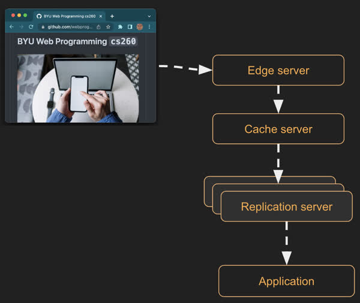
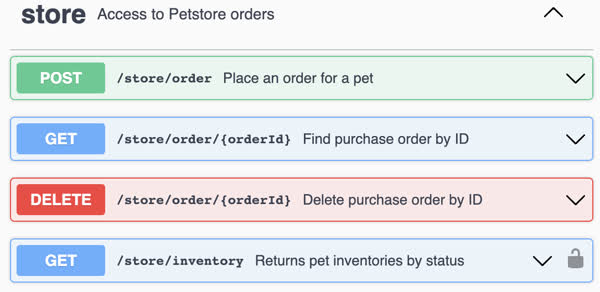

# Service design

Web services provide the interactive functionality of your web application. They commonly authenticate users, track their session state, provide, store, and analyze data, connect peers, and aggregate user information. Making your web service easy to use, performant, and extensible are factors that determine the success of your application. A good design will result in increased productivity, satisfied users, and lower processing costs.

## Model and sequence diagrams

When first considering your service design it is helpful to model the application's primary objects and the interactions of the objects. You should attempt to stay as close to the model that is in your user's mind as possible. Avoid introducing a model that focusing on programming constructs and infrastructure. For example, a chat program should model participants, conversations, and messages. It should not model user devices, network connections, and data blobs.

Once you have defined your primary objects you can create sequence diagrams that show how the objects interact with each other. This will help clarify your model and define the necessary endpoints. You can use a simple tool like [SequenceDiagram.org](https://sequencediagram.org/index.html#initialData=C4S2BsFMAIGEAsCGxqIA5oFCcQY2APYBO0AguCLpDvsdAEIEBG25lkAtAHwDKkRAN34AuPikQDEIcIiZRMjJtz6CRY1JOmz5igDy6OHFUKLC2VDVJlzq5yPsPGRDZpa03Md5fxOjgiIhRcAgA7EwBnZBBQ6AB3MHgXFj0DIx8RWFCIqJiiSABHAFdIcJQQglAAM0ockIVmb1VTUlwqNBQ7aGCw-kjQUPqlXnTTHkQAT2gAIgAJSHBwAinoQjIKKkwnIm47YVn5xeXKogIAWySgA) to create and share diagrams.


## Leveraging HTTP

Web services are usually provided over HTTP, and so HTTP greatly influences the design of the service. The HTTP verbs such as GET, POST, PUT, and DELETE often mirror the designed actions of a web service. For example, a web service for managing comments might list the comments (GET), create a comment (POST), update a comment (PUT), and delete a comment (DELETE). Likewise, the MIME content types defined by IANA are a natural fit for defining the types of content that you want to provide (e.g. HTML, PNG, MP3, and MP4). The goal is to leverage those technologies as much as possible so that you don't have to recreate the functionality they provide and instead take advantage of the significant networking infrastructure built up around HTTP. This includes caching servers that increase your performance, edge servers that bring your content closer, and replication servers that provide redundant copies of your content and make your application more resilient to network failures.



## Endpoints

A web service is usually divided up into multiple service endpoints. Each endpoint provides a single functional purpose. All of the criteria that you would apply to creating well designed code functions also applies when exposing service endpoints.



⚠ Note that service endpoints are often called an Application Programming Interface (API). This is a throwback to old desktop applications and the programming interfaces that they exposed. Sometimes the term API refers to the entire collection of endpoints, and sometimes it is used to refer to a single endpoint.

Here are some things you should consider when designing your service's endpoints.

- **Grammatical** - With HTTP everything is a resource (think noun or object). You act on the resource with an HTTP verb. For example, you might have an order resource that is contained in a store resource. You then create, get, update, and delete order resources on the store resource.
- **Readable** - The resource you are referencing with an HTTP request should be clearly readable in the URL path. For example, an order resource might contain the path to both the order and store where the order resource resides: `/store/provo/order/28502`. This makes it easier to remember how to use the endpoint because it is human readable.
- **Discoverable** - As you expose resources that contain other resources you can provide the endpoints for the aggregated resources. This makes it so someone using your endpoints only needs to remember the top level endpoint and then they can discover everything else. For example, if you have a store endpoint that returns information about a store you can include an endpoint for working with a store in the response.

  ```http
  GET /store/provo  HTTP/2
  ```

  ```json
  {
    "id": "provo",
    "address": "Cougar blvd",
    "orders": "https://cs260.click/store/provo/orders",
    "employees": "https://cs260.click/store/provo/employees"
  }
  ```

- **Compatible** - When you build your endpoints you want to make it so that you can add new functionality without breaking existing clients. Usually this means that the clients of your service endpoints should ignore anything that they don't understand. Consider the two following JSON response versions.

  **Version 1**

  ```js
  {
    "name": "John Taylor"
  }
  ```

  **Version 2**

  ```js
  {
    "name": "John Taylor",
    "givenName": "John",
    "familyName": "Taylor"
  }
  ```

  By adding a new representation of the `name` field, you provide new functionality for clients that know how to use the new fields without harming older clients that ignore the new fields and simply use the old representation. This is all done without officially versioning the endpoint.

  If you are fortunate enough to be able to control all of your client code you can mark the `name` field as depreciated and in a future version remove it once all of the clients have upgraded. Usually you want to keep compatibility with at least one previous version of the endpoint so that there is enough time for all of the clients to migrate before compatibility is removed.

- **Simple** - Keeping your endpoints focused on the primary resources of your application helps to avoid the temptation to add endpoints that duplicate or create parallel access to primary resources. It is very helpful to write some simple class and sequence diagrams that outline your primary resources before you begin coding. These resources should focus on the actual resources of the system you are modeling. They should not focus on the data structure or devices used to host the resources. There should only be one way to act on a resource. Endpoints should only do one thing.

- **Documented** - The [Open API Specification](https://spec.openapis.org/oas/latest.html) is a good example of tooling that helps create, use, and maintain documentation of your service endpoints. It is highly suggested that you make use of such tools in order to provide client libraries for your endpoints and a sandbox for experimentation. Creating an initial draft of your endpoint documentation before you begin coding will help you mentally clarify your design and produce a better final result. Providing access to your endpoint documentation along with your production system helps with client implementations and facilitates easier maintenance of the service. The [Swagger Petstore](https://petstore.swagger.io/) example documentation is a reasonable example to follow.

There are many models for exposing endpoints. We will consider three common ones, RPC, REST, and GraphQL.

## RPC

Remote Procedure Calls (RPC) expose service endpoints as simple function calls. When RPC is used over HTTP it usually just leverages the POST HTTP verb. The actual verb and subject of the function call is represented by the function name. For example, `deleteOrder` or `updateOrder`. The name of the function is either the entire path of the URL or a parameter in the POST body.

```http
POST /updateOrder HTTP/2

{"id": 2197, "date": "20220505"}
```

or

```http
POST /rpc HTTP/2

{"cmd":"updateOrder", "params":{"id": 2197, "date": "20220505"}}
```

One advantage of RPC is that it maps directly to function calls that might exist within the server. This could also be considered a disadvantage as it directly exposes the inner workings of the service, and thus creates a coupling between the endpoints and the implementation.

## REST

Representational State Transfer (REST) attempts to take advantage of the foundational principles of HTTP. This is not surprising considering the principle author of REST, Roy Fielding, was also a contributor to the HTTP specification. REST HTTP verbs always act upon a resource. Operations on a resource impact the state of the resource as it is transferred by a REST endpoint call. This allows for the caching functionality of HTTP to work optimally. For example, GET will always return the same resource until a PUT is executed on the resource. When PUT is used, the cached resource is replaced with the updated resource.

With REST the updateOrder endpoint would look like the following.

```http
PUT /order/2197 HTTP/2

{"date": "20220505"}
```

Where the proper HTTP verb is used and the URL path uniquely identifies the resource. These seem like small differences, but maximizing HTTP pays dividends by making it easy for HTTP infrastructure, such as caching, to work properly.

There are several other pieces of [Fielding's dissertation](https://www.ics.uci.edu/~fielding/pubs/dissertation/top.htm) on REST, such as hypermedia, that are often quoted as being required for a truly "restful" implementation, and these are just as often ignored.

## GraphQL

GraphQL focuses on the manipulation of data instead of a function call (RPC) or a resource (REST). The heart of GraphQL is a query that specifies the desired data and how it should be joined and filtered. GraphQL was developed to address frustration concerning the massive number of REST, or RPC calls, that a web application client needed to make in order to support even a simple UI widget.

Instead of making a call for getting a store, and then a bunch of calls for getting the store's orders and employees, GraphQL would send a single query that would request all of that information in one big JSON response. The server would examine the query, join the desired data, and then filter out anything that was not wanted.

Here is an example GraphQL query.

```graphql
query {
  getOrder(id: "2197") {
    orders(filter: { date: { allofterms: "20220505" } }) {
      store
      description
      orderedBy
    }
  }
}
```

GraphQL helps to remove a lot of the logic for parsing endpoints and mapping requests to specific resources. Basically in GraphQL there is only one endpoint. The query endpoint.

The downside of that flexibility is that the client now has significant power to consume resources on the server. There is no clear boundary on what, how much, or how complicated the aggregation of data is. It also is difficult for the server to implement authorization rights to data as they have to be baked into the data schema. However, there are standards for how to define a complex schema. Common GraphQL packages provide support for schema implementations along with database adaptors for query support.
